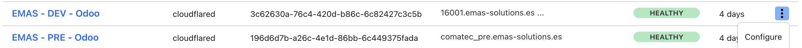
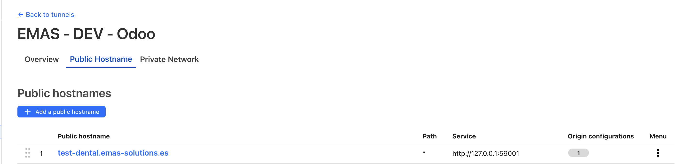
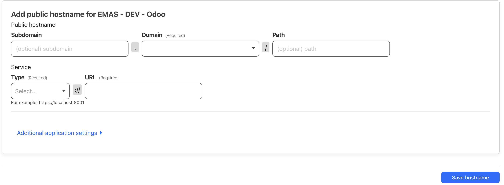
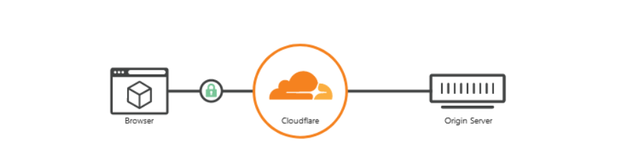
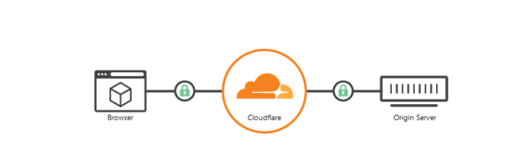

# Crear subdominio

#### [Tiene un tunel la maquina servidor?](index.md#tengo-tunel)

Debemos ir al apartado de Zero Trust → Tunnels de la página [Dashboard de Cloudflare](https://one.dash.cloudflare.com/).

Una vez aquí vamos a ver listados todos los túneles existentes enlazados a nuestra cuenta.
La página muestra una lista de túneles con:  
 
- El nombre del túnel  
- La URL o Dirección desde la que se accede al túnel  
- Su estado (Funcional o No)  

Si le damos a configurar un tunel _(sabiendo a que maquina se dirige éste)_, podemos ver, modificar y crear los subdominios que deseemos.
  

Configuración:

En la sección de Public Hostname vamos a configurar como se relaciona el dominio de acceso con el puerto e IP de la máquina destino. Si le damos click a nuevo vamos a ver la siguiente configuración:

Aquí hay 2 partes a tener en cuenta.
##### Dominio
En las primeras 3 cajas vamos a determinar la configuración de dominio. Imaginemos en este caso que el dominio desde el que queremos acceder al servicio que servira este tunel es tutorial_cloudflare.emas-solutions.es.  

- `tutorial_cloudflare` va a ser el subdominio y debería ser diferente para cada servicio
- `emas_solutions.es` es nuestro dominio, que deberá seleccionarse de los dominios existentes
- La parte de PATH la dejaremos vacía ya que normalmente se usa para sub- servicios.

##### Servicio
En la parte de abajo habrá la configuración que sirve para conectar con el servicio deseado en la máquina destino (servidor).
En este ejemplo vamos a servir una app simple en la misma máquina que expone el puerto 12345.
Generalmente los servicios en local se acceden por HTTP, así que eso es lo que pondremos:

#### Resumen
La configuración explicada consigue que desde el dominio tutorial_cloudflare.emas_solutions.es podamos acceder al servicio que se ejecuta en la
máquina por el puerto 12345 como si estuviéramos en esta.  

Servido desde HTTPS por supuesto.  

Entonces si desde la maquina ejecutamos localhost:12345 deberemos ver lo mismo que visitando el dominio especificado.

#### Annexos
Normalmente las conexiones de los túneles son de HTTP a HTTPS, siendo así solo encriptadas desde Cloudflare al público:
  
Si bien esto facilita mucho las cosas al no requerir ninguna configuración ni montaje relacionada con los certificados; puede llegar a provocar algún problema al tratar con servicios y conexiones más complejas como la integración de Outlook mail de Microsoft.  

Entonces en algún caso se encripta con certificado la conexión a dos bandas:

