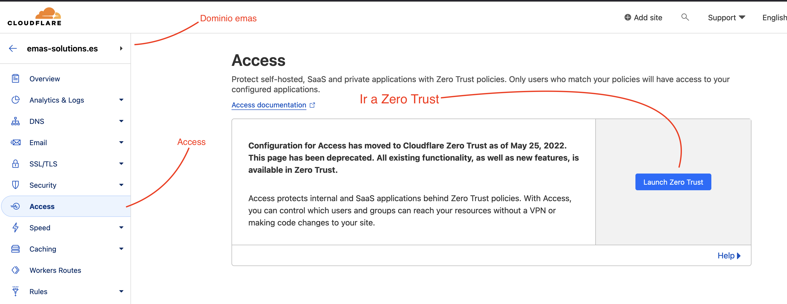
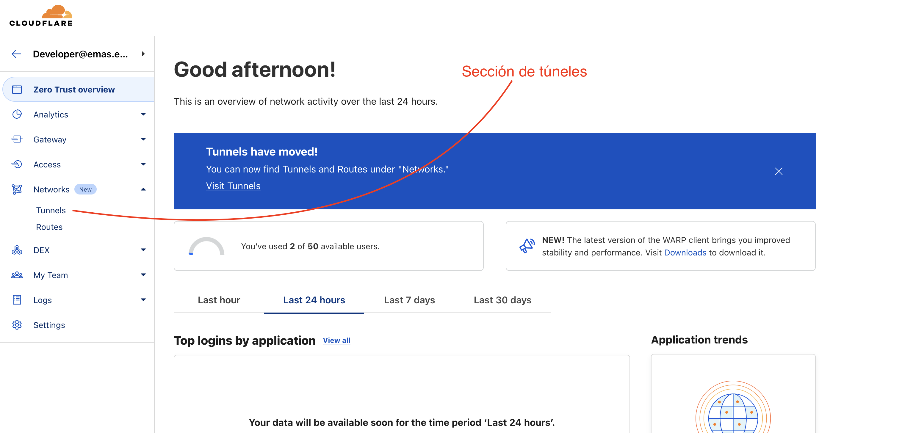
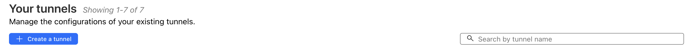

# Que es un túnel?
Un túnel de Cloudflare es una conexión segura que permite enrutar el tráfico de un servidor web a través del domino especificado. Esto proporciona beneficios como mejoras en la seguridad, el rendimiento y la disponibilidad del sitio web de manera segura y extremadamente sencilla.

### Quiero un nuevo subdominio disponible, como creo el túnel?
És posible que no necesites crear un túnel; cada máquina o servidor que tenga servicios a publicar solo necesita __un solo túnel__ _([o ninguno*](#Túnel maestro)_),
ya que éste va a crear nuestra salida de la maquina hacia la gestión de Cloudflare, desde la que se hará la configuración de todos servicios y dominios existentes.

##### [Quiero crear solo un subdominio](basic_config.md)

#### La máquina tiene un túnel
Es posible que la máquina en la que se pretende instalar el acceso Cloudflare ya
disponga de un túnel instalado.  

Si tenemos acceso SSH a la máquina podemos comprobar la existencia de túneles en
ésta:  

`cloudflared tunnel list`

En caso de que de que no haya túneles o no exista cloudflared podemos proceder igual ya que la máquina está limpia.

#### Creación de un túnel _(Zero Trust)_
Cuando sabemos que una maquina no tiene túneles el proceso de montaje de uno es muy sencillo:  

Debemos ir al apartado de Zero Trust → Tunnels de la página [Dashboard de Cloudflare](https://one.dash.cloudflare.com/).

Una vez aquí vamos a ver listados todos los túneles existentes enlazados a nuestra cuenta.
La página muestra una lista de túneles con:  
 
- El nombre del túnel  
- La URL o Dirección desde la que se accede al túnel  
- Su estado (Funcional o No)  

Para crear un túnel en una máquina en la que no exista ninguno le podemos dar a crear
y copiar el script de instalado __(seleccionar sistema operativo primero)__, ésto va a hacer el montaje solo; en cuanto finalize podremos ver el estado __conectado__ al final de ésta página.  

### Annexo
#### Túnel maestro
Proximamente...

