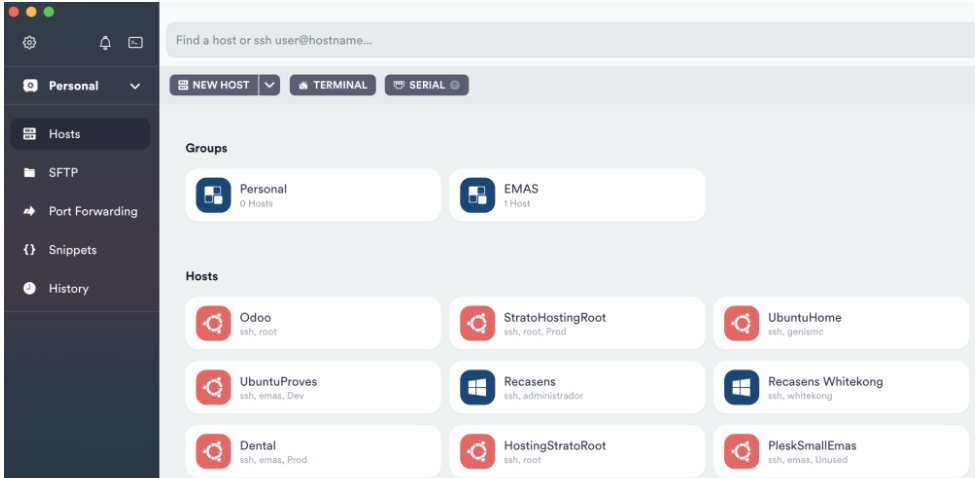

# Gestión de servidores Odoo
### Odoo services, setup y restarts
Estando en el servidor queremos listar los servicios existentes:  
`ls /etc/systemd/system`  
Esto nos mostrarà todos los serviciones disponibles en la maquina.  

Para ver el estado de un servicio:  
`systemctl status <nombre del servicio>`  
Para reiniciar un servicio:  
`systemctl restart <nomre del servicio>`  
> Ejemplo: `systemctl restart odoo17001`
### SSH
Para connectar al servidor que hostea nuestos servicios de Odoo utilizamos ssh.  

Usando línea de comandos sería:  

`ssh <ip> -l <usuario>`  
> Ejemplo: `ssh 192.168.1.207 -l root`  

Una herramienta muy útil es [Termius](https://termius.com/).
Ésta nos guarda los servidores y sus credenciales para tenerlos siempre a disposición:

